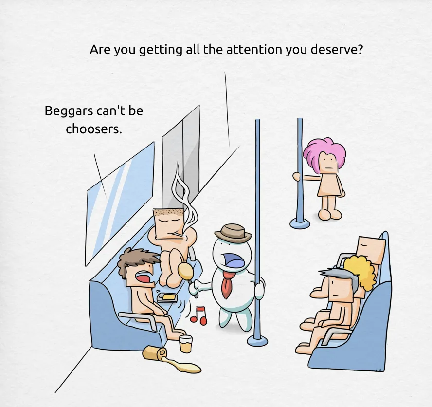
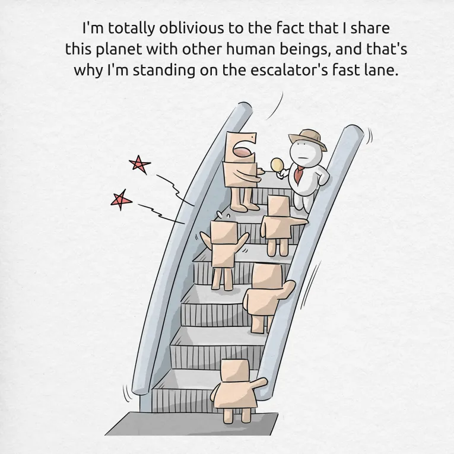
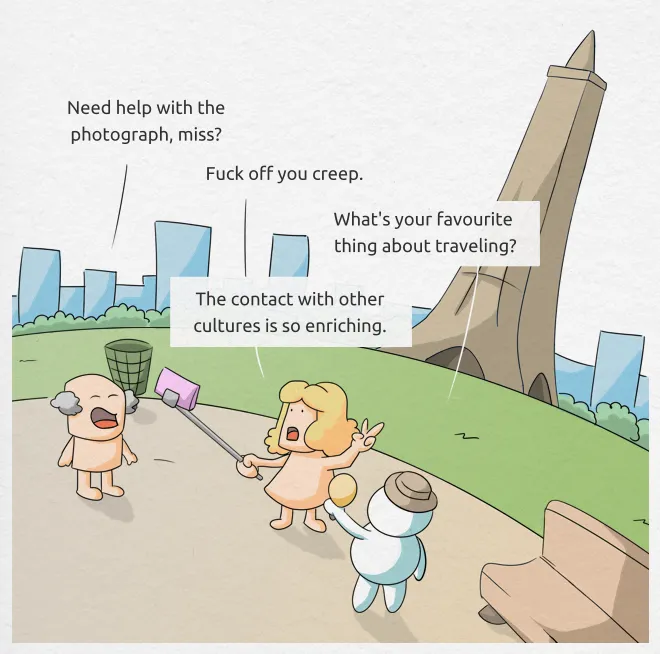
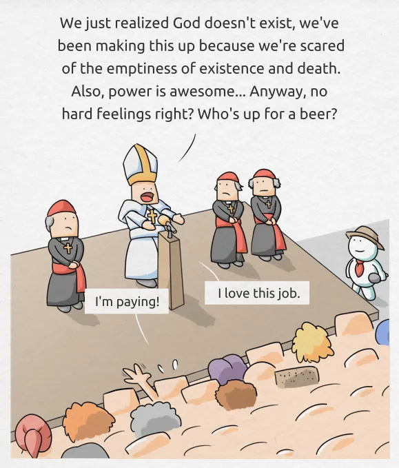
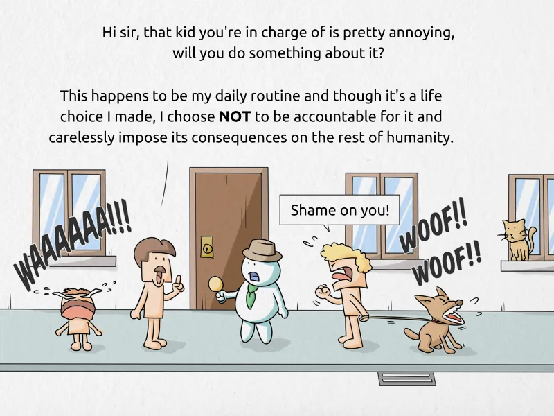
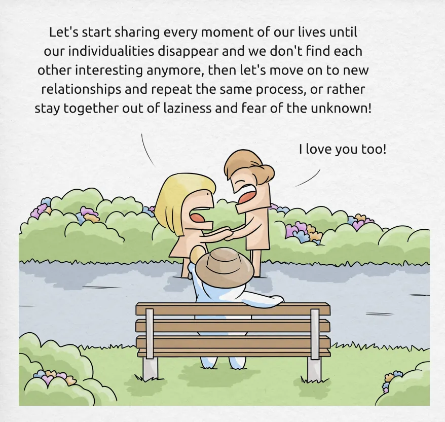
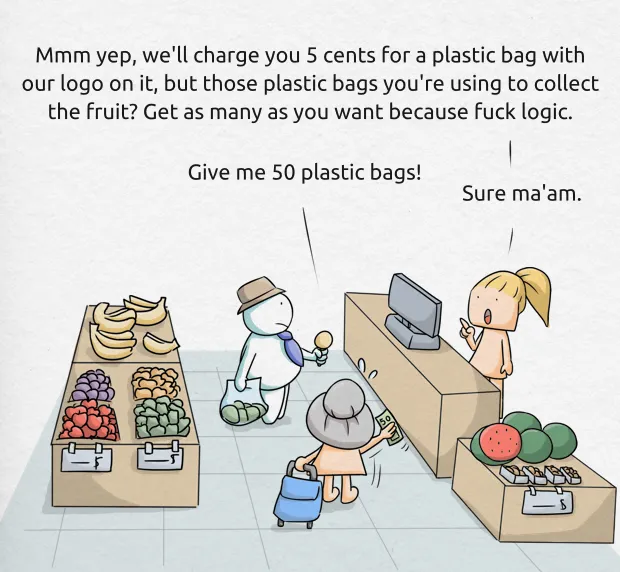

### Bob 101: The arrival
Bob is a plutonian reporter. He came to Earth because he was bored and had nothing better to do. Bob has a magic microphone that enhances self-awareness for the time it takes to answer his questions. This allows Bob to report the truth, even when it’s hidden under layers of ignorance and self-deception.

### Bob 102: The mall

### Bob 103: The lunch break
Bob managed to infiltrate a major company. Sooner or later they’ll find out he’s not a senior Java programmer and fire him, or promote him to CTO.

### Bob 104: The selfie stick

### Bob 105: The Pope
Now Bob is in Vatican City. The Pope is giving a public speech to his followers and Bob somehow managed to switch the Pope’s microphone with his magic one. Bob is going to destroy religion with his fucked up plutonian science! Religion disappeared from Pluto 56 million years ago, since then plutonians have dealt with their own problems.

### Bob 106: The social contract

### Bob 107: The circus
So there was this very important football game that would decide the future of the world and Bob went to a bar to report about it.

### Bob 108: The one
Bob is starting to get the hang of this. Sometimes he doesn’t even have to ask the questions anymore, he just flashes his magic microphone here and there and humans blow his mind with their bullshit. 

### Bob 109: The logic

