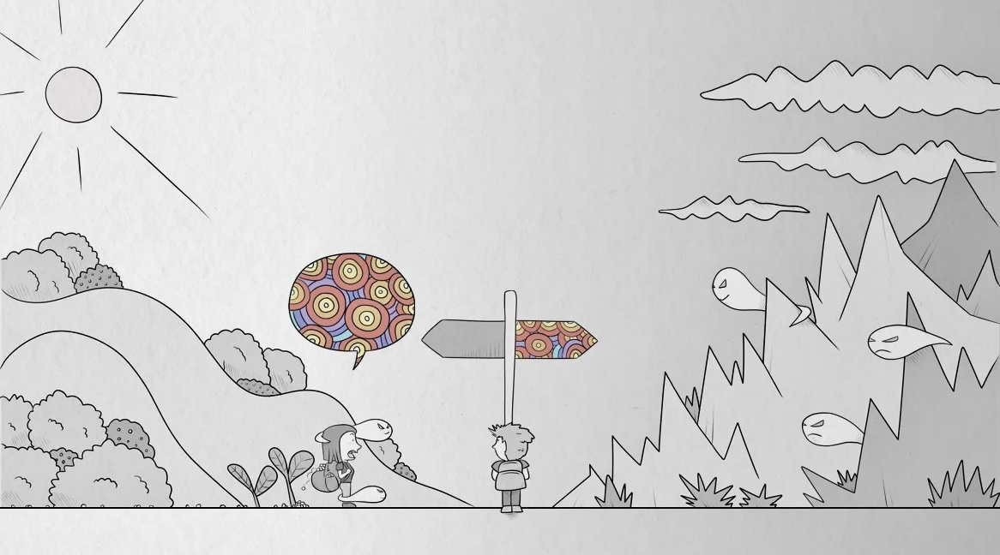

De la Wikipedia:

> Color blindness is the decreased ability to see color or differences in color. The severity of color blindness ranges from mostly unnoticeable to full absence of color perception. Color blindness is usually an inherited problem or variation in the functionality of one or more of the three classes of cone cells in the retina, which mediate color vision. The most common form is caused by a genetic condition called congenital red–green color blindness (including protan and deutan types), which affects up to 1 in 12 males (8%) and 1 in 200 females (0.5%). The condition is more prevalent in males, because the opsin genes responsible are located on the X chromosome. Rarer genetic conditions causing color blindness include congenital blue–yellow color blindness (tritan type), blue cone monochromacy, and achromatopsia. Color blindness can also result from physical or chemical damage to the eye, the optic nerve, parts of the brain, or from medication toxicity.

No és que faci falta per entendre el dibuix, que no s'entén gaire igualment, però aquí queda.

