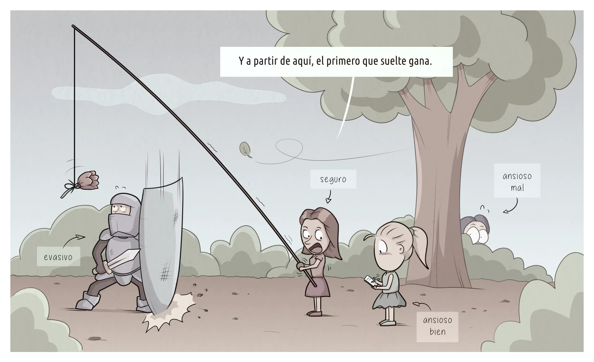

La idea general de la **teoría del apego** (John Bowlby, Mary Ainsworth) es que de pequeños nos vinculamos a figuras protectoras de las que recibimos (o no) una base segura para explorar el mundo. Si esas figuras transmiten seguridad, los niños crecen psicológicamente "sanos". Si no, delinquen o hacen dibujos.

Croquis de los tipos de apego:

- **Apego seguro**: El niño explora el entorno aún en ausencia de las figuras de apego. Confianza en la predecibilidad y seguridad del vínculo.
- **Apego inseguro ansioso o ambivalente**: El niño siente miedo ante la ausencia de las figuras de apego e interrumpe la exploración del entorno. Figuras de apego impredecibles, dependencia emocional.
- **Apego inseguro evitativo o evasivo**: El niño muestra indiferencia ante la ausencia de las figuras de apego pero se detecta ansiedad latente (posición defensiva). Rechazo, inexpresión emocional o aversión al contacto físico por parte de las figuras de apego. Genera incapacidad/dificultad para vincularse.
- **Apego inseguro desorganizado**: Comportamiento bipolar y contradictorio en las relaciones, en ocasiones oscilando entre ansioso y evitativo. Abusos y experiencias traumáticas con las figuras de apego.

