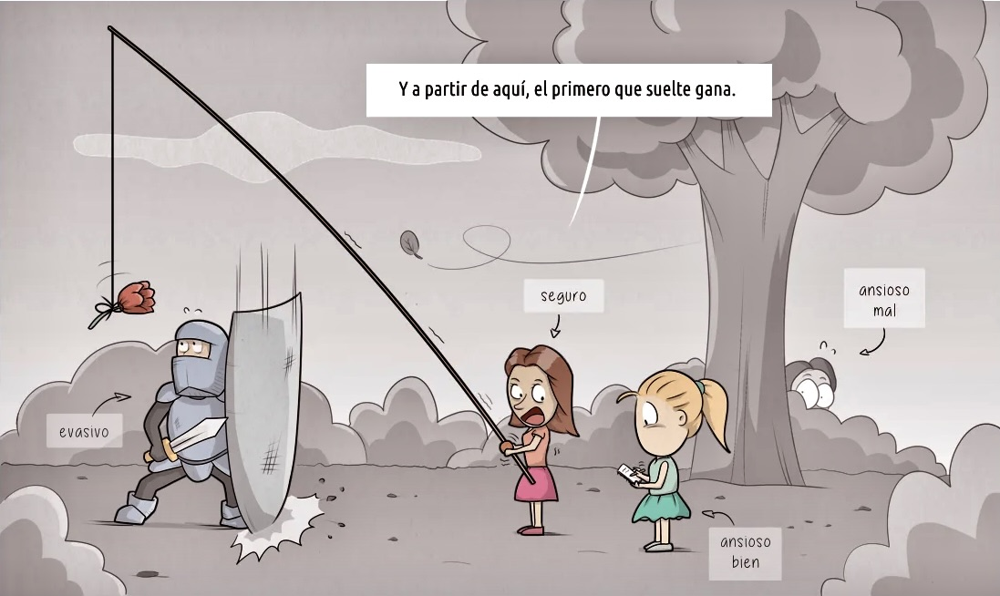

La **teoría del apego** surge de **John Bowlby** y los posteriores estudios de **Mary Ainsworth**  (1969-1980). La idea general es que los bebés se vinculan a figuras paternales de las que reciben (o no) una base segura para explorar el mundo. Si esas figuras transmiten seguridad, los bebés crecen psicológicamente "sanos". Si no, delinquen o hacen dibujos.

Resumen aproximado de los tipos de apego existentes:

- **Apego seguro**: El niño busca las figuras de apego cuando no estan presentes, pero ello no le impide explorar el mundo. Se alegra y reconecta con ellas a su regreso. Todo bien.
- **Apego inseguro ansioso/ambivalente**: El niño siente miedo ante la ausencia de las figuras de apego e interrumpe la exploración del entorno. Figuras de apego impredecibles, dependencia emocional.
- **Apego inseguro evitativo**: El niño muestra indiferencia superficial ante la ausencia de las figuras de apego pero se detecta ansiedad latente (posición defensiva). Rechazo, inexpresión emocional o aversión al contacto físico por parte de las figuras de apego. Genera incapacidad/dificultad para vincularse.
- **Apego inseguro desorganizado**: Comportamiento bipolar y contradictorio en las relaciones, en ocasiones oscilando entre ansioso y evitativo. Abusos y experiencias traumáticas con las figuras de apego.

